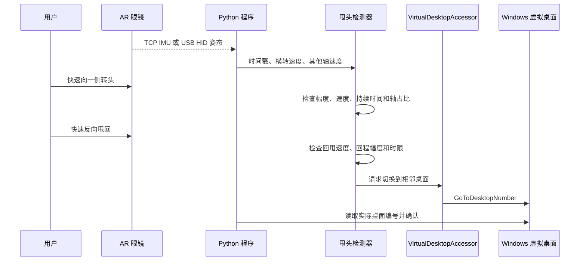

# AR 眼镜甩头切换 Windows 虚拟桌面

这是一个面向 Windows 的轻量工具：AR 眼镜继续作为普通外接显示器输出原生画面，程序读取眼镜姿态，并把一次“快速转头 + 快速反向甩回”映射为 Windows 虚拟桌面切换。

项目基于 [L4TN/XREAL-3D-Workspace-Workaround-Virtual-Desktops](https://github.com/L4TN/XREAL-3D-Workspace-Workaround-Virtual-Desktops) 演进。当前版本改为直接适配 **XREAL One Pro TCP IMU** 和 **INAIR Pro USB HID**，并加入双阶段甩头识别、停稳重置、采样异常保护与真实桌面切换确认。

当前发布版本：`20260911-final-no-log`。

## 项目用途

Windows 会把 AR 眼镜识别为一块外接屏幕。本项目利用 Windows 自带的虚拟桌面模拟左右多块工作区：

1. 在 Windows 中创建多个虚拟桌面。
2. 把不同应用安排在不同桌面。
3. 戴上眼镜快速向一侧转头，再快速反向甩回。
4. 程序调用 `VirtualDesktopAccessor.dll` 切换到相邻桌面。

它不会创建真正的空间屏幕，也不会进行 3D 渲染、画面重投影或窗口空间锚定。

## 核心功能

- 支持启动时按 `1` 选择 INAIR Pro、按 `2` 选择 XREAL One Pro。
- 支持 `-Inair` 和 `-Xreal` 命令行参数直接选择硬件。
- 只有快速外甩和快速反向回甩均达标时才切换桌面。
- 单向转头、缓慢往返、小幅抖动和明显的非横向动作不会触发切换。
- 每次成功后在当前朝向重新建立动作起点，不要求回到最初正前方。
- 停稳与冷却机制可防止一次动作引发连续切换。
- XREAL 使用实机数据拟合的 `Y−Z` 横转合成轴，并处理 Windows 重复接收时间戳。
- INAIR 使用融合姿态四元数和设备时间戳，不与 XREAL 共用网络接口或轴映射。
- 切换后读取实际桌面编号，区分“已发送请求”和“系统已完成切换”。
- 支持任意数量的 Windows 虚拟桌面，默认允许桌面 1 参与切换，边界处不循环。
- 正常运行不生成日志文件。

## 已验证硬件

| 硬件 | 数据接口 | 当前映射 | 状态 |
| --- | --- | --- | --- |
| XREAL One Pro | TCP `169.254.2.1:52998` | `Y−Z` 合成横转轴 | 已通过实机甩头与连续桌面切换日志调试 |
| INAIR Pro | USB HID `0483:5750`，接口 `MI_02` | 融合姿态的 Z 轴横转 | 已通过目标设备的 64 字节 HID 报告和实机切换日志调试 |

其他 XREAL、INAIR 型号及不同固件没有验证，不能假定使用相同的数据格式、接口或轴方向。

## 工作流程



## 运行环境

- Windows 10 或 Windows 11，64 位。
- 64 位 Python 3.11。当前测试使用 Python 3.11；其他版本尚未系统验证。
- `VirtualDesktopAccessor.dll` 与主程序位于同一目录。
- 至少创建两个 Windows 虚拟桌面。
- INAIR 模式需要 Python 包 `hidapi`。
- XREAL 模式需要电脑能够访问眼镜的 `169.254.2.1:52998` TCP 服务。

Windows 虚拟桌面内部接口会随系统版本变化。如果程序无法读取或切换桌面，需要从 [VirtualDesktopAccessor Releases](https://github.com/Ciantic/VirtualDesktopAccessor/releases) 获取与当前 Windows 构建匹配的 64 位 DLL。

## 准备步骤

### 1. 创建虚拟桌面

按 `Win + Ctrl + D` 创建桌面。可以先准备三个桌面，分别放置左侧、中央和右侧工作内容。

### 2. 准备 Python

批处理依次查找：

1. 环境变量 `AR_PYTHON` 指向的解释器；
2. 程序目录下的 `inairenv\Scripts\python.exe`；
3. 用户目录下的 `inairenv\Scripts\python.exe`。

可以在 PowerShell 中创建环境：

```powershell
python -m venv inairenv
```

使用 INAIR 时安装 HID 依赖：

```powershell
./inairenv/Scripts/python.exe -m pip install hidapi
```

如果 `python` 指向 Microsoft Store 执行别名，请改用真实 Python 解释器的完整路径创建环境。

### 3. 连接眼镜

**XREAL One Pro**

- 让眼镜正常作为 Windows 外接显示器工作。
- 保证对应网络接口已建立，并可访问 `169.254.2.1:52998`。
- 启动校准期间保持眼镜静止，程序最多等待约 10 秒寻找稳定采样窗口。

**INAIR Pro**

- 通过 USB 连接眼镜。
- 程序只打开 VID/PID 为 `0483:5750` 且路径包含 `MI_02` 的 HID collection。
- 如果同时枚举到零个或多个匹配接口，程序会拒绝猜测设备。

## 启动方法

### 一键启动

完整解压项目文件，双击：

```text
Start_AR_Switcher.bat
```

启动菜单无需按回车：

- `1`：INAIR Pro
- `2`：XREAL One Pro
- `q`：退出

### PowerShell 启动

```powershell
./inairenv/Scripts/python.exe ./main_udp_yaw_desktop_switcher.py -Inair
./inairenv/Scripts/python.exe ./main_udp_yaw_desktop_switcher.py -Xreal
```

只读硬件枚举，不连接 IMU 或切换桌面：

```powershell
./inairenv/Scripts/python.exe ./main_udp_yaw_desktop_switcher.py -Inair --diagnose
./inairenv/Scripts/python.exe ./main_udp_yaw_desktop_switcher.py -Xreal --diagnose
```

INAIR 屏幕诊断模式，不切换桌面且不保存日志：

```powershell
./inairenv/Scripts/python.exe ./main_udp_yaw_desktop_switcher.py -Inair --imu-debug
```

## 甩头操作

- 快速向左转头，再快速反向甩回：切换到前一个桌面。
- 快速向右转头，再快速反向甩回：切换到后一个桌面。
- 只向一个方向转头不会切换。
- 外甩或回甩过慢不会切换。
- 每次动作完成后自然停稳，再开始下一次。
- 到达第一个或最后一个桌面时保持当前桌面，不循环跳转。

运行中终端需要保持焦点，支持以下按键：

| 按键 | 作用 |
| --- | --- |
| `q` | 退出 |
| `i` | 反转左右切换方向 |
| `z` | 清除当前手势状态，在新的朝向重新等待停稳 |
| `r` | XREAL 重新校准零偏；INAIR 重置姿态处理状态 |
| `d` | 开关详细屏幕调试输出 |
| `=` / `-` | 增加或减小最小外甩角度，每次 5° |
| `[` / `]` | 减少或增加外甩时间窗口，每次 100ms |
| `a` | 进入 6 秒三轴辅助诊断；期间不会切换桌面 |
| `1` / `2` / `3` | 手动改用 X/Y/Z 原始轴，并退出 XREAL `Y−Z` 合成映射 |

## 默认手势参数

参数集中在 `main_udp_yaw_desktop_switcher.py` 顶部。修改后应重新运行测试并进行实机验证。

| 参数 | 默认值 | 用途 |
| --- | ---: | --- |
| `MIN_EXCURSION` | 12° | 外甩最小角度 |
| `START_RATE` | 18°/s | 开始追踪的速度 |
| `PEAK_RATE` | 80°/s | 外甩快速段速度门槛 |
| `RETURN_RATE` | 80°/s | 反向回甩速度门槛 |
| `FAST_HOLD_MS` | 35ms | 外甩和回甩快速段的最短累计时间 |
| `GLANCE_WINDOW_MS` | 650ms | 外甩确认窗口 |
| `RETURN_WINDOW_MS` | 450ms | 回甩确认窗口 |
| `GESTURE_WINDOW_MS` | 1200ms | 完整动作总时限 |
| `SWITCH_COOLDOWN_MS` | 350ms | 成功切换后的最短冷却时间 |
| `STILL_HOLD_MS` | 220ms | 重新建立动作起点所需停稳时间 |
| `EXCLUDE_DESKTOP_1` | `False` | 是否禁止手势切换到桌面 1 |
| `CENTER_DESKTOP` | 2 | XREAL 启动定位的中央桌面 |

## 项目文件

```text
.
├─ main_udp_yaw_desktop_switcher.py  主程序、桌面控制和硬件调度
├─ head_flick.py                     可回放的双阶段甩头状态机
├─ imu_stream.py                     XREAL TCP 帧解析与连续采样时钟
├─ inair_stream.py                   INAIR HID 接收线程
├─ inair_pose.py                     INAIR 姿态报告解码
├─ inair_diagnostics.py              INAIR 只读屏幕诊断
├─ hardware_options.py               硬件选择和设备枚举
├─ VirtualDesktopAccessor.dll        Windows 虚拟桌面访问组件
├─ Start_AR_Switcher.bat             Windows 一键启动脚本
└─ test_*.py                         离线测试
```

## 测试

测试不会连接眼镜，也不会切换真实桌面：

```powershell
python -m unittest discover -v
```

当前发布源码包含 74 项测试，覆盖双阶段动作、慢动作和单向动作拒绝、回弹锁止、任意朝向重新就绪、重复时间戳、XREAL 合成轴、INAIR 报告解码、硬件选择以及桌面请求确认。

## 已知限制

- 这是 Windows 虚拟桌面切换工具，不是 Nebula、VertoXR 或其他空间桌面环境的完整替代品。
- 虚拟桌面的窗口分配、动画、快捷键和系统行为由 Windows 管理。
- XREAL TCP 地址和帧格式来自当前已验证设备；固件变化可能导致连接或解析失败。
- INAIR 64 字节报告格式由目标设备采样推断，并非厂商公开协议保证。
- `VirtualDesktopAccessor.dll` 依赖未公开的 Windows 虚拟桌面接口，系统更新后可能需要更换匹配版本。
- 当前只对表格中列出的两个型号完成了实机调试。
- 程序不会生成运行日志；排查新硬件或新固件问题时需要临时加入诊断代码。

## 第三方组件与来源

- 原始项目：[L4TN/XREAL-3D-Workspace-Workaround-Virtual-Desktops](https://github.com/L4TN/XREAL-3D-Workspace-Workaround-Virtual-Desktops)，GPL-3.0。
- `VirtualDesktopAccessor.dll`：[Ciantic/VirtualDesktopAccessor](https://github.com/Ciantic/VirtualDesktopAccessor)，MIT；许可文本见 [`LICENSES/VirtualDesktopAccessor-MIT.txt`](LICENSES/VirtualDesktopAccessor-MIT.txt)。
- INAIR 模式的可选 Python 依赖：[`hidapi`](https://github.com/trezor/cython-hidapi)。该依赖不包含在本仓库中，请遵循其上游许可。

本项目不隶属于或代表 XREAL、INAIR、Microsoft、Nebula 或 VertoXR。

## 许可证

本项目代码沿用 GNU General Public License v3.0，详见 [`LICENSE`](LICENSE)。第三方组件分别适用其自身许可证。
